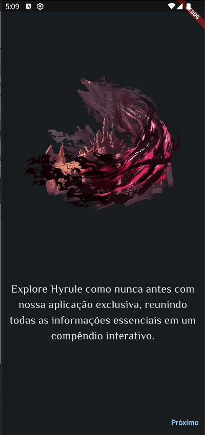

## Iniciando o projeto:

Para rodar o projeto rode os seguintes comandos em seu terminal:

```shell
flutter pub get
```

```shell
flutter run
```

## O que é o projeto?



O projeto é um compendium chamado Hyrule. Essa aplicação mostra diversas informações sobre itens, equipamentos, monstros e mais, que existem no jogo Zelda: Breath of the Wild.
